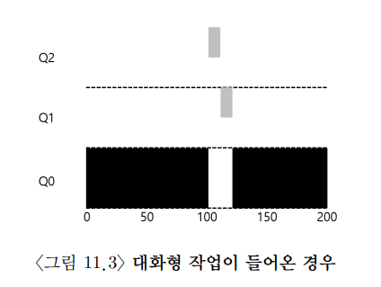
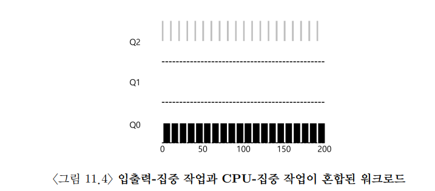
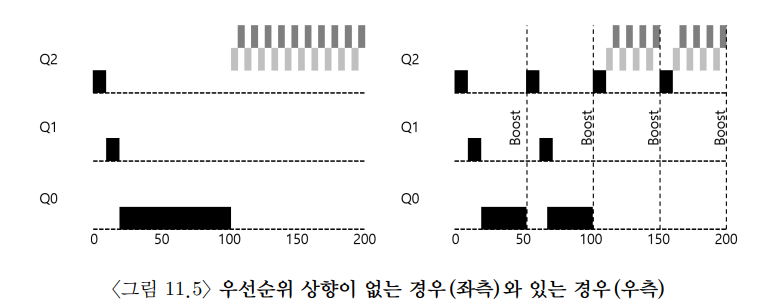
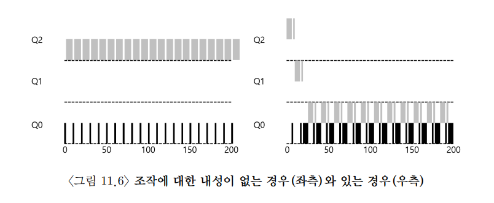
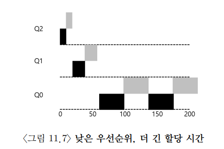

CPU Scheduling 
==============

우선 MLFQ가 해결하려는 기본적인 문제는 두 가지이다.

1. 짧은 작업을 먼저 실행시켜서 반환 시간을 최적화 하고자 한다.

   ->SJF나 STCF 같은 알고리즘은 작업의 실행 시간 정보를 필요로 하지만, 실제로는 실행시간을 미리 알 수 없다.

2. interactive job들에 대해서는 응답 시간을 최적화 하여 빠른 시스템이라는 느낌을 주고 싶다.

   ->RR과 같은 알고리즘은 응답 시간을 최적화 하지만, 반환시간은 최악이다....

이러한 문제점을 해결하기 위해서 MLFQ 알고리즘이 도입된다.

MLFQ 스케줄링의 핵심은 우선순위를 정하는 방식이다.
----------------------------------------
 사용자와 상호작용을 해야하는 Interative job은 높은 우선순위를 가지고,

 CPU 연산을 많이 해야하는 Intencive CPU job은 낮은 우선순위를 가진다.

## MLFQ의 두 가지 기본 규칙은 다음과 같다.

### 규칙 1: Priority(A) > Priority(B)이면, A가 실행된다.
### 규칙 2: Priotiry(A) == Prioriry(B)이면, A,B는 RR 방식으로 실행된다.

그러면... 상대 적으로 우선순위가 높은 프로세스들만 실행되게 된다... 

MLFQ가 작업의 우선순위를 어떻게 바꿀 것인지 결정해야 한다.

## 시도 1 : 우선순위의 변경

### 규칙 3: 작업이 시스템에 진입하면, 가장 높은 우선순위, 즉 맨위의 큐에 놓여진다.
### 규칙 4a: 주어진 타임 슬라이스를 모두 사용하면, 우선순위는 낮아진다. 즉, 한 단계 아래 큐로 이동한다.
### 규칙 4b: 타임 슬라이스를 소진하기 전에 CPU를 양도하면 같은 우선순위를 유지한다.

  
검정 작업: A, 회색 작업: B

스케쥴러는 작업이 짧은 작업인지 긴 작업인지 알 수 없기 떄문에 일단은 짧은 작업이라고 가정하여 높은 우선순위를 부여한다.

만약 진짜 짧은 작업이라면 빨리 실행되고 종료 될것이고, 긴 작업이라면, 점차 하위 큐로 이동하여 RR 방식으로 작업하여 종료 될것이다.

-> MLFQ는 SJF에 근사할 수 있다.

# 그러나... 또 문제가 발생한다.

## 1. starvation 
 시스템에 너무 많은 interactive job(대화형 작업)이 많으면, 그 작업들이 CPU 시간을 소모하게 될것이고,
 
intencive CPU job(CPU 집중 작업)들은 CPU 시간을 할당 받지 못할 것이다.

## 2. 자신들에게 유리하게 스케줄러를 조작할 수 있다.
A라는 프로세스가 타임 슬라이스가 끝나기 전에 강제로 yield 시스템 콜을 통해서 cpu를 양도하면, A는 계속해서 높은 우선순위를 가지게 될것이고,
CPU를 거의 독점할 수 있다.

## 3. 프로세스의 특성의 변화를 조정할 수 없다.
처음에는 CPU 위주의 작업이 나중에는 대화형 작업으로 바뀌는 프로세스가 있다고 하면, 과연 프로세스의 우선순위를 위로 올려줄 수 있나?
아니다!

그러면... 또 다른 시도를 해보자.

## 시도 2 : 우선순위 상향 조정

간단하게는 주기적으로 모든 작업의 우선순위를 상향 조정(boost)하자.

### 규칙 5: 일정 기간 S가 지나면, 시스템의 모든 작업을 최상위 큐로 올려준다.

위의 규칙을 통해서 starvation 문제와 CPU 위주의 작업이 대화형 작업으로 특성이 변할 경우 우선순위 상향을 통해 스케쥴러가 변경된 특성에 적합한 스케쥴링 방법을 적용한다.

그리고 S 값은 부두 상수로 너무 크면, 긴 실행 시간을 가진 작업은 starved 될 수 있고, 너무 작으면, 대화형 작업이 적절한 양의 CPU 시간을 사용할 수 없게 된다.

## 시도 3 : 더 나은 시간 측정

MLFQ의 각 단계에서 CPU 총 사용 시간을 측정하는 것이다. 즉, 프로세스가 타임 슬라이스에 해당하는 시간을 모두 소진하면,다음 우선순위 큐로 강등된다.
규칙 4a와 4b를 합쳐서 다시 정의하면...

### 규칙 4: 주어진 단계에서 시간 할당량을 소진하면(CPU를 몇 번 양도하였는지 상관없이), 우선순위는 낮아진다.

## MLFQ 조정과 다른 쟁점들

필요한 변수들을 스케쥴러가 어떻게 설정해야 하는지? 몇 개의 큐가 존재해야하는지? 큐당 타임 슬라이스의 크기는 어느정도로 해야 하는지?
얼마나 자주 우선순위가 상향 조정되어야 하는지? 

하나만 살펴 보면, 큐당 타임 슬라이스의 크기는 우선순위가 높을수록 작게하고, 우선순위가 낮을수록 크게 한다.

## MLFQ 요약

#### • 규칙 1 : 우선순위 (A)> 우선순위 (B) 일 경우, A가 실행, B는 실행되지 않는다.

#### • 규칙 2 : 우선순위 (A) = 우선순위 (B), A와 B는 RR 방식으로 실행된다.

#### • 규칙 3 : 작업이 시스템에 들어가면 최상위 큐에 배치된다.

#### • 규칙 4 : 작업이 지정된 단계에서 배정받은 시간을 소진하면 (CPU를 포기한 횟수와 상관없이), 작업의 우선순위는 감소한다 (즉, 한 단계 아래 큐로 이동한다).

#### • 규칙 5 : 일정 주기 S 가 지난 후, 시스템의 모든 작ᨦ을 최상위 큐로 이동시킨다.

<참조: 운영체제 아주 쉬운 세가지 이야기, chap 11>
